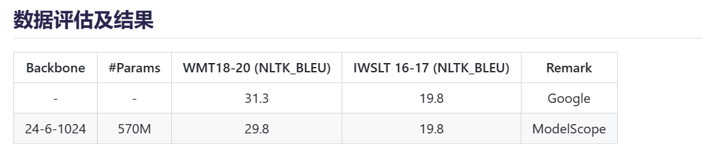

# free-translate-api

提供免费翻译模型，效果近乎媲美谷歌，无限字符，可本地构建翻译api，支持中文，英语，法语，俄语，西班牙语语言互译。

模型来自于modelscope，https://github.com/modelscope/modelscope

尤其感谢魏相鹏提供的帮助，https://github.com/pemywei/csanmt

本项目适合有一定算力并且有翻译需求的人，该项目基于modelscope提供的模型搭建翻译api。

```bash
# install
pip install -r requirements.txt
# run app
python3 app.py
```

默认直接运行python3 app.py为英译中，修改app.py中supertranslate初始化参数（模型存放文件夹）即可自定义语言

默认端口为6006，访问示例可参考test.py

支持并行翻译，长段落有多句的建议自行拆分，多句话和超过128个token可能出现漏译的情况


